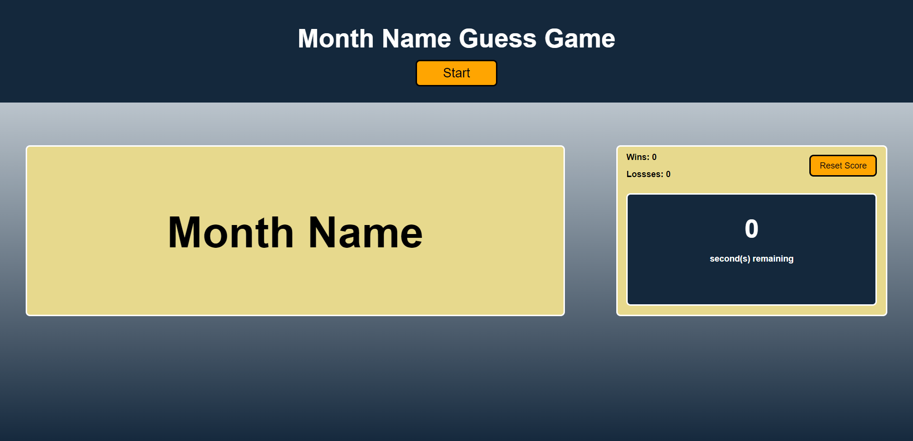

# Word Guess Game
Word guess game where user needs to guess the month name.

## Description
The game works as follows:
- User starts the game by clicking "Start" button.
- Month name is generated randomly with few blank spaces.
- User needs to guess the name of the month and fill in blank spaces.
- User get 10 seconds to guess the name of the month.
- If user guesses the name correctly, the timer stops and wins count is incremented by 1.
- If user fails to guess the name correctly before the timer reaches 0, the losses count is incremented by 1.
- Wins and losses are stored in local storage for user to track the progress.
- "Reset Score" button resets the wins and losses to 0.

## Deployment
The webpage is deployed to GitHub pages. Use below link to visit the webpage: https://nileshpatel83.github.io/word-guess-game/

## Screenshot

## License
Please refer to the LICENSE in the repo.
